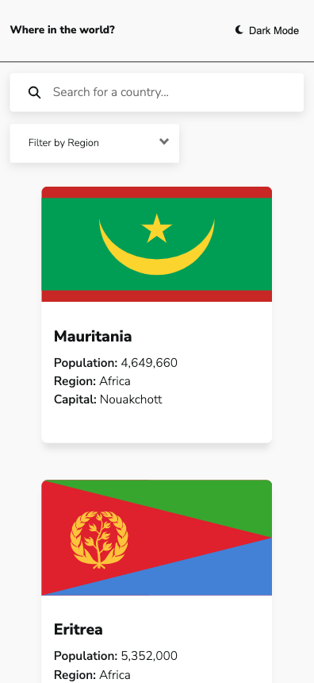
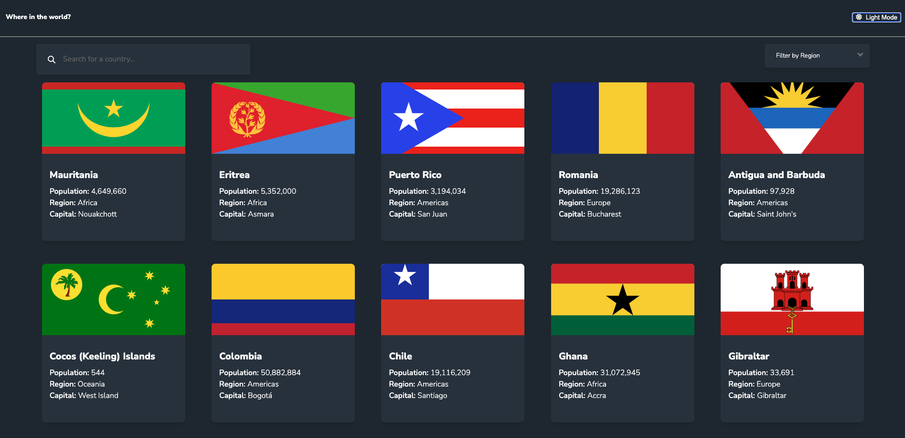

# Frontend Mentor - REST Countries API with color theme switcher solution

This is a solution to the [REST Countries API with color theme switcher challenge on Frontend Mentor](https://www.frontendmentor.io/challenges/rest-countries-api-with-color-theme-switcher-5cacc469fec04111f7b848ca). Frontend Mentor challenges help you improve your coding skills by building realistic projects.

## Table of contents

- [Overview](#overview)
  - [The challenge](#the-challenge)
  - [Screenshot](#screenshot)
  - [Links](#links)
- [My process](#my-process)
  - [Built with](#built-with)
  - [What I learned](#what-i-learned)
  - [Continued development](#continued-development)
- [Author](#author)

## Overview

### The challenge

Users should be able to:

- See all countries from the API on the homepage
- Search for a country using an `input` field
- Filter countries by region
- Click on a country to see more detailed information on a separate page
- Click through to the border countries on the detail page
- Toggle the color scheme between light and dark mode _(optional)_

### Screenshot

### Links

- Solution URL: [Github repo](https://github.com/alex-castelo/fe-mentor-api-country-list)
- Live Site URL: [Live site](https://alex-castelo.github.io/fe-mentor-api-country-list/)

## My process

### Built with

- [Vue 3](https://vuejs.org/)
- [Vite](https://vitejs.dev/)
- [Typescript](https://www.typescriptlang.org/)
- Hexagonal architecture
- [Playwright - E2E testing](https://playwright.dev/)

### What I learned

When I started this project I had some ideas and things I wanted to test:

- First of all, I wanted to try `Playwright` for E2E testing. (this is awesome)
- Secondly, wanted to build some CI Steps - (did it with E2E tests)
- And, while I'm learning about software arhitectures, I've tried to follow HEX Architecture in this project. (still learning)

### Continued development

If I had more time I could refactor components, try to improve the performance (especially when all the countries are loaded) because there are many nodes to render for the DOM and I'm sure it can be improved. I could also add unit tests and finish polishing the responsive design to make it "pixel perfect", but so far I'm satisfied because I've been able to try new things and I think it has turned out pretty well.

## Author

- Frontend Mentor - [@alex-castelo](https://www.frontendmentor.io/profile/alex-castelo)
- Twitter - [@jove_nai](https://mobile.twitter.com/jove_nai)
